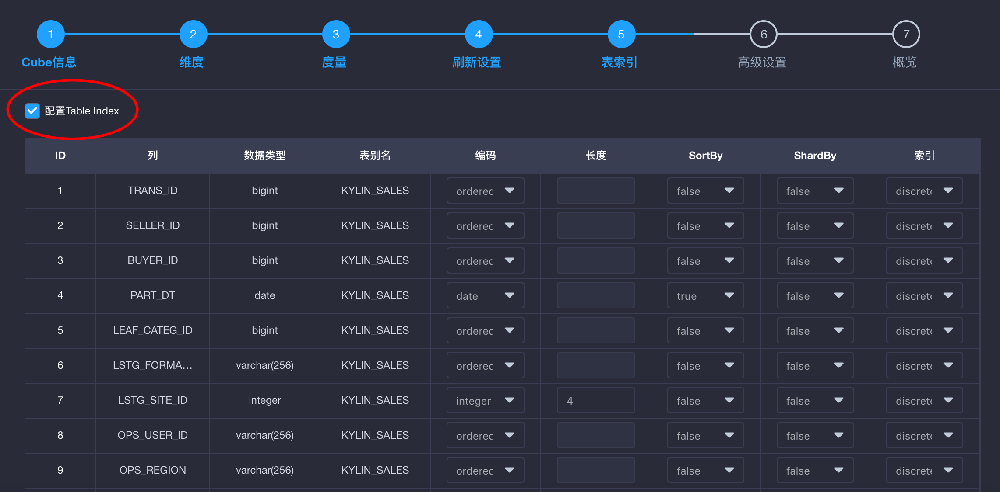

## 表索引

为了支持对明细数据进行高效的查询，KAP 提供了表索引功能。对于定制查询，KAP 使用构建良好的 Cube 来进行高效的处理；对于非定制查询，Query pushdown 提供了补充和完善。上述功能可以充分满足您快速获取聚合查询结果的需求。如果您在分析过程中对明细数据感兴趣，则可以通过表索引来达成目的。

### 创建表索引

表索引的创建流程嵌套在 Cube 创建流程内。如图所示，点击**创建 Cube** 按钮，进入一般 Cube 创建流程：


进入 Cube 创建向导的第5步（以2.4以上版本为准）——**表索引**，可以观察到**配置表索引**的选项，默认状态下未被勾选：


勾选**配置表索引**选项以启用表索引。勾选后可以看到表索引设置的详细情况。其中每一行的内容是您可以对数据表中某一列进行的配置：



在 **SortBy** 和 **ShardBy** 中选择适当的列，点击下拉列表将其设置为 **SortBy** 或 **ShardBy**，并为每一列选择适当的编码方式。完成 Cube 创建流程。构建该 Cube 之后，即可对相应数据进行明细查询。

### SortBy 和 ShardBy

合理地设置表中的某列为 SortBy 以及 ShardBy，可以显著提高表索引的查询效率。下面为您详细介绍这两项属性的含义和设置技巧。

在设置表索引时，您应当将至少1列设置为 SortBy。被设置为 SortBy 的列将显示在表索引各列设置信息的下方，如图所示：


对于所有被设置为 SortBy 的列，明细数据将按照这些列的顺序依次进行排序。您可以拖拽其中一列并向上或向下以改变它们的顺序。

SortBy 列表中的第1列编码必须为“integer”，“date”或“time”类型。其他列的类型不做限制。关于编码的内容详见下文。

在 SortBy 列表中排序靠前的列，作为查询过滤条件时将获得更高的效率。因此推荐您将 SortBy 的各列按照实际情况下作为过滤条件的概率进行排序。不建议您将过多的列设置为 SortBy，因为排序靠后的列对提高查询效率的效果有限，且会增加表索引构建时的开销。推荐您使用时间字段的列作为 SortBy 的第1列，以便在以时间相关的大量查询上达到更快的查询效果。

> 例如：当您使用形如下例的 SQL 语句对一组股票交易的数据进行分析时，您可以考虑将成交时间（TRADING_TRACK）这一列设置为 SortBy 列，以提升按照时间窗口进行查询时的效率：
>
> ```sql
> select * from TRADING_TRACK
> where CLOSING_TIME > timestamp'2017-01-01 00:00:00'
> and CLOSING_TIME < timestamp'2017-04-01 00:00:00'
> ```

在设置明细表时，您可以选择1列设置为 ShardBy 或不指定 ShardBy。如果您指定了 ShardBy 的列，则明细数据将按照该列的值分片。如果您没有指定 ShardBy 的列，则默认将根据所有列中的数据进行分片。

选择适当的 ShardBy 列，可以使明细数据较为均匀地分散在多个数据片上，提高并行性，进而获得更理想的查询效率。建议选择基数较大的列作为 ShardBy 列，以避免数据分散不均匀。

> 例如：当您使用形如下例的 SQL 语句对一组通讯记录的数据进行分析时，用户的手机号码（PHONE_NUMBER）这一列常有较大的基数，且很可能被用作过滤条件。在这种情况下，推荐您将该列设置为 ShardBy 列。
>
> ```sql
> select * from CALLING_TRACK
> where PHONE_NUMBER = '13800000000'
> ```

### 编码

在表索引设置页中，点击每一字段对应的**编码**下拉列表 ，可以为该字段的列选择编码，如图所示：


+ “orderedbytes”：可用于所有类型。它会在编码时保持数据的顺序。它也是大多数情况下的默认的编码。
+ “var”：类似于“orderedbytes”，除了它不会保存顺序信息。因此该编码不建议使用，请用“orderedbytes”代替。 
+ “boolean”：适用于字段值为：true、false、TRUE、FALSE、True、False、t、f、T、F、yes、no、YES、NO、Yes、No、y、n、Y、N、1、0等的列。
+ “integer”：适用于字段值为整数的列，支持的整数区间为[-2^(8\*N-1), 2^(8*N-1)]。 
+ “int”：已弃用，请使用“integer”代替。 
+ “date”：适用于字段值为日期的列，支持的格式包括yyyyMMdd、yyyy-MM-dd、yyyy-MM-dd HH:mm:ss、yyyy-MM-dd HH:mm:ss.SSS，其中如果包含时间戳部分会被截断。
+ “time”：适用于字段值为时间戳的列，支持范围为[1970-01-01 00:00:00, 2038/01/19 03:14:07] ，毫秒部分会被忽略。“time”编码适用于“time”、“datetime”、“timestamp”等类型。
+ “fix_length”：适用于超高基场景，将选取字段的前 N 个字节作为编码值。当 N 小于字段长度时，会造成字段截断。当 N 较大时，会使得开销较高，查询性能下降。只适用于 varchar 或 nvarchar 类型。当您为 MD5 值等固定长度的字段编码时，可以使用该编码。
+ “fixed_length_hex”：适用于字段值为十六进制字符，如 1A2BFF 或者 FF00FF 。每两个字符需要一个字节。只适用于 varchar 或 nvarchar 类型。

**注意：“dict”编码在表索引中并不支持。**

### 索引

在明细表设置页中，点击每一字段对应的**索引**下拉列表 ，可以为该字段的列选择索引类型，如图所示：


+ “discrete”索引是默认索引。该索引可以支持快速匹配相等查询，在大于或小于查询时效会退化为全表查询。

+ “fuzzy”索引是服务于含有 like 过滤的查询的。如果某一列可能应用 like 过滤，请将其设置为“fuzzy”。不建议将过多的列设置为“fuzzy”，因为该类型索引会增加存储开销。

  > 例如：当您对一组商品订单的数据进行分析时，您可以考虑将商品名称的索引类型设置为“fuzzy”，以使得包含商品名称模糊匹配的查询能够被更加高效地处理。